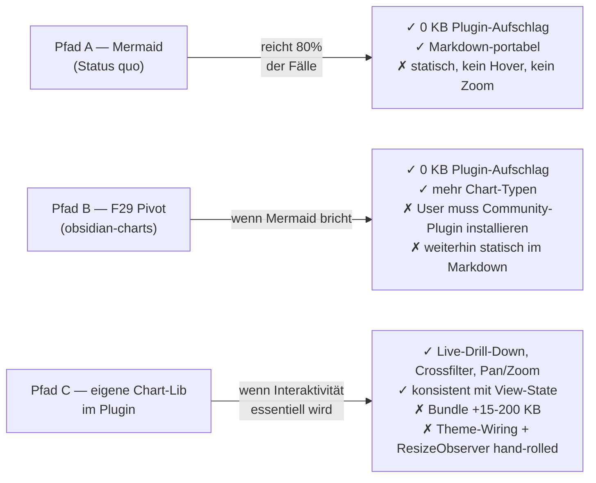

# Finance Plugin — UI-Cookbook

> Status: 2026-05-26 · Erstellt anlässlich der AdminLTE-Anfrage. Komplementiert `docs/design.md` (Token-/Wiring-Stand) um konkrete UI-Pattern + Chart-Strategie für trigger-driven Slice-11+-Items (F27/F29).

---

## 1) Chart-Strategie — F27/F29 Reality-Check + drei Pfade

### Reality-Check: F27 ist nicht „die Chart-Slice"

Vor allem anderen — F27/F29 wurden in der Anfrage zusammengezogen. Sie sind getrennt:

| Item | Was es ist | Wo es lebt |
|------|------------|-----------|
| **F27 Pattern-aware Prognose** | **Backend-Algorithmus-Change**: ersetzt `ist · tage_total / tage_bisher` durch `sum(geplante Recurring-Tx im Monatsrest) + variable_ist · ratio`. Output: zwei Zahlen („Naiv" vs. „Pattern-aware") in der Budget-Übersicht-Section der Monatsberichte. | `src/importer/output/budget.py` (Python-CLI, nicht TS-Plugin) |
| **F29 obsidian-charts-Plugin-Pivot** | **Contingency-Pivot** wenn Mermaid-Render in Bases-Embeds bricht: alternative Render-Variante via `obsidian-charts`-Community-Plugin (Chart.js-Wrapper) für die in Monatsberichten eingebetteten Pie/Bar-Charts. Default bleibt Mermaid bis Trigger feuert. | `src/importer/output/body_template.py` (`render_chart_obsidian(...)` analog zu `render_mermaid_pie`) |

**Aktueller Chart-Stack laut Slice-9:** *Mermaid* `pie` + `bar`, server-rendered vom Importer in Markdown-Notes geschrieben. Das Plugin selbst rendert keine Charts.

### Drei Pfade für Charts in diesem Ökosystem



**Heuristik wann welcher Pfad:**
- **Pfad A bleibt Default** für alles, was als statischer Bericht in einer Note konsumiert wird (Monatsbericht-Pie, Quartalsbericht-Bar). Mermaid-Bruchstellen sind selten, und wenn sie kommen, ist F29 die punktuelle Antwort.
- **Pfad B (F29)** triggert nur on-demand wenn Mermaid in einem konkreten Bases-Embed nicht rendert. Kein proaktiver Sweep.
- **Pfad C** triggert dann, wenn ein Plugin-View **interaktive** Charts braucht — z.B. `FinanceDashboardView` mit Saldo-Trend, der bei TBC-Toggle live re-rendert, oder `LedgerView` mit Sparkline pro Konto-Zeile. **F27 selbst braucht Pfad C nicht** — die zwei Prognose-Werte könnten auch nur als Cards angezeigt werden. Interaktiv-Trigger entsteht erst, wenn jemand „zeig mir die Prognose grafisch und lass mich am Slider die Annahmen ändern" sagt.

### Chart-Lib-Vergleich für Pfad C

Wenn Pfad C eines Tages getriggert wird, hier die ehrliche Tabelle:

| Aspekt | **uPlot** | **Chart.js** | **eCharts** |
|--------|-----------|--------------|-------------|
| **Bundle gzip** | ~15 KB (Core) + ~2 KB (Bands-Plugin) | ~60 KB (auto-Bundle) — ~30 KB tree-shaked auf line+bar+pie | ~200 KB (Core+Common) — ~140 KB minimal |
| **Time-Series-Performance** | **Best-in-class** — 10k+ Punkte butterweich (Canvas, kein DOM-Overhead) | OK bis ~1-2k Punkte, danach Lag in Animationen | Sehr gut, ähnlich uPlot, aber schwererer Init |
| **Chart-Typen** | Cartesian-Lines/Bars only — **kein Pie/Doughnut** | Line/Bar/Pie/Doughnut/Radar/Scatter/Polar/Bubble — **alles Standard** | Alles + Sankey, Tree, Graph, Heatmap, Geo |
| **Confidence-Bänder** | `uplot-bands`-Plugin (offiziell, ~2 KB) | nativ via `fill: '+1'` zwischen Serien | nativ via `markArea`/`series.areaStyle` |
| **Annotations** (z.B. „Gehalt", „Miete") | Plugin `uplot-annotations` oder hand-gezeichnete vertikale Linien | `chartjs-plugin-annotation` (~10 KB extra) | nativ via `markLine`/`markPoint` |
| **Theming via CSS-Vars** | manuell — `getComputedStyle().getPropertyValue('--fl-...')` pro Render-Call | partial — Color-Hooks via `data.datasets[].borderColor`, kein Live-CSS-Var-Listening | manuell wie uPlot, aber `setOption()` für Live-Theme-Swap |
| **Tooltip-Customization** | Custom-Hook (`opts.cursor.points`) — vollständige Kontrolle, aber DOM-Wiring selbst | Eingebauter Tooltip-Plugin (`plugins.tooltip.callbacks`) — flexibel, weniger Boilerplate | Eingebaut, sehr mächtig, deklarativ |
| **TypeScript-Defs** | Community (`@types/uplot`) — solide, manche neuere Plugins fehlen | **First-class offiziell** | First-class offiziell |
| **Mobile-Touch** | OK (Pan/Zoom via Plugin) | OK (Pinch-Zoom mit `chartjs-plugin-zoom`) | OK, nativ |
| **Last-Maintained** | aktiv (`leeoniya/uPlot`, Releases 2025/26) | aktiv (`chartjs/Chart.js`, v4 stabil) | aktiv (`apache/echarts`, v5 stabil) |
| **Render-Engine** | Canvas (kein SVG, kein WebGL) | Canvas | Canvas + optional SVG |
| **A11y** | minimal — Container braucht `role="img"` + `aria-label` hand-gewickelt | partial — `aria-label` auf Canvas möglich, Datentabellen-Fallback fehlt | besser — `aria.enabled: true` generiert Decal-Patterns + Label |
| **Lizenz** | MIT | MIT | Apache-2.0 |

### Empfehlung für dieses Plugin

Wenn Pfad C triggert: **Chart.js**. Begründung in drei Sätzen:

1. **Mixed Chart-Typen sind realistisch.** Finanzdomäne braucht über die Zeit Line (Saldo-Trend, Prognose) **plus** Pie (Kategorie-Split) **plus** Bar (Monats-Spend). uPlot kann kein Pie — du landest sonst bei zwei Libs.
2. **TS-First-Class und Tooltip-API sparen Tage.** Das Plugin nutzt strict TS; Chart.js liefert offizielle Typen, uPlot zwingt zu `@types`-Maintenance. Tooltip-Callbacks für KSP-Token-konformes Theming sind in Chart.js 10 Zeilen, in uPlot 30+.
3. **Bundle-Aufschlag ist tragbar.** Tree-shaked Chart.js mit nur Line/Bar/Pie ≈ 30 KB gzip — das Plugin geht von 57 KB auf ~85 KB. Akzeptabel für eine Feature-Klasse mit hoher Sichtbarkeit. eCharts ist 4× größer und gewinnt erst, wenn Sankey/Tree/Geo gebraucht werden.

**Sonderfall:** Wenn F27/F28 plötzlich zu „Live-Saldo-Trend mit 5 Jahren tagesgenauer Daten + Slider für Hypothetische" eskaliert (10k+ Punkte, hohe Interaktion, kein Pie/Bar nötig) → dann uPlot pur. Aber das ist heute nicht der Zustand.

**Wenn du nichts tun kannst:** bleib bei Mermaid (Pfad A). Der Pivot-Schmerz auf Chart.js entsteht erst, wenn er entsteht.

---

## 2) Production-ready Snippets

Alle Snippets sind selbst-enthalten und nutzen das Bestand-`--fl-*`-Token-System sowie Obsidians native APIs. TS strict-kompatibel, ARIA-annotated, mobile-aware, Edge-Cases gehandhabt.

### Snippet 1 — Chart.js Saldo-Trend in einer View

Theme-synchron via ResizeObserver + MutationObserver auf `<body class="theme-...">`. Empty-State + Error-Fallback. ARIA-Label aus Daten generiert.

```typescript
import {
  Chart,
  LineController,
  LineElement,
  PointElement,
  LinearScale,
  TimeScale,
  Tooltip,
  Filler,
  type ChartConfiguration,
} from 'chart.js';
import 'chartjs-adapter-date-fns';

Chart.register(LineController, LineElement, PointElement, LinearScale, TimeScale, Tooltip, Filler);

export interface SaldoPoint { date: Date; saldoCents: number; }

/** Rendert einen Saldo-Trend-Chart in `host`. Gibt die Chart-Instanz zurück
 *  oder `null` bei leerer Daten-Serie. Caller ist für `chart.destroy()` zuständig
 *  (idealerweise in `onClose()` der View). */
export function renderSaldoTrend(
  host: HTMLElement,
  points: ReadonlyArray<SaldoPoint>,
  opts: { label: string; accountType?: 'asset' | 'liability' } = { label: 'Saldo' },
): Chart | null {
  // Empty-State: keine Daten -> Hinweis statt leerem Canvas
  if (points.length === 0) {
    host.createDiv({
      cls: 'fl-chart-empty',
      text: 'Keine Daten im gewählten Zeitraum.',
      attr: { role: 'status', 'aria-live': 'polite' },
    });
    return null;
  }

  const cs = getComputedStyle(document.body);
  const cssVar = (name: string, fallback = '#888') =>
    cs.getPropertyValue(name).trim() || fallback;

  // Account-Type bestimmt Linie-Farbe via KSP-Token
  const lineColor = opts.accountType === 'liability'
    ? cssVar('--fl-acct-liability', '#d9534f')
    : cssVar('--fl-acct-asset', '#5cb85c');

  const canvas = host.createEl('canvas', {
    cls: 'fl-chart',
    attr: {
      role: 'img',
      'aria-label':
        `${opts.label}: Saldo-Verlauf von ${points[0].date.toLocaleDateString('de-DE')} ` +
        `bis ${points[points.length - 1].date.toLocaleDateString('de-DE')}, ` +
        `${points.length} Datenpunkte`,
    },
  });

  const config: ChartConfiguration<'line'> = {
    type: 'line',
    data: {
      datasets: [{
        label: opts.label,
        data: points.map(p => ({ x: p.date.getTime(), y: p.saldoCents / 100 })),
        borderColor: lineColor,
        backgroundColor: lineColor + '22',
        fill: true,
        tension: 0.2,
        pointRadius: points.length > 200 ? 0 : 2,  // Performance: keine Punkte bei Long-Series
        borderWidth: 2,
      }],
    },
    options: {
      responsive: true,
      maintainAspectRatio: false,
      interaction: { mode: 'index', intersect: false },
      plugins: {
        legend: { display: false },
        tooltip: {
          backgroundColor: cssVar('--background-secondary'),
          titleColor: cssVar('--text-normal'),
          bodyColor: cssVar('--text-normal'),
          borderColor: cssVar('--background-modifier-border'),
          borderWidth: 1,
          callbacks: {
            label: (ctx) => `${opts.label}: ${ctx.parsed.y.toLocaleString('de-DE', {
              style: 'currency', currency: 'EUR',
            })}`,
          },
        },
      },
      scales: {
        x: {
          type: 'time',
          time: { unit: points.length > 90 ? 'month' : 'day' },
          ticks: { color: cssVar('--text-muted') },
          grid: { color: cssVar('--background-modifier-border') },
        },
        y: {
          ticks: {
            color: cssVar('--text-muted'),
            callback: (v) => `${v} €`,
          },
          grid: { color: cssVar('--background-modifier-border') },
        },
      },
    },
  };

  try {
    return new Chart(canvas, config);
  } catch (err) {
    console.error('[finance] Chart render failed', err);
    canvas.remove();
    host.createDiv({ cls: 'fl-chart-error', text: 'Chart konnte nicht gerendert werden.' });
    return null;
  }
}
```

CSS-Companion:

```css
.fl-chart { width: 100%; min-height: 240px; }
.fl-chart-empty,
.fl-chart-error {
  padding: 24px;
  text-align: center;
  color: var(--text-muted);
  background: var(--background-secondary);
  border-radius: var(--radius-m);
}
.fl-chart-error { color: var(--text-error); }
```

---

### Snippet 2 — Hand-rolled Tab-Strip (ARIA-konform, Keyboard-navigierbar)

W3C-Tabs-Pattern: `role="tablist" | "tab" | "tabpanel"`, Roving-Tabindex, Pfeil-Navigation, Home/End. Keine Lib-Abhängigkeit.

```typescript
import { setIcon } from 'obsidian';

export interface TabDef { id: string; label: string; icon?: string; }

/** Erzeugt einen ARIA-konformen Tab-Strip. Caller verwaltet das Panel-Rendering
 *  via `onChange`. Gibt eine `setActive(id)`-Funktion für externe Steuerung zurück. */
export function tabStrip(
  host: HTMLElement,
  tabs: ReadonlyArray<TabDef>,
  onChange: (id: string) => void,
  opts: { initial?: string; ariaLabel?: string } = {},
): { setActive: (id: string) => void; destroy: () => void } {
  if (tabs.length === 0) throw new Error('tabStrip: tabs[] darf nicht leer sein');

  const initial = opts.initial && tabs.find(t => t.id === opts.initial)
    ? opts.initial
    : tabs[0].id;

  const bar = host.createDiv({
    cls: 'fl-tabs',
    attr: { role: 'tablist', 'aria-label': opts.ariaLabel ?? 'Ansichten' },
  });

  const buttons = new Map<string, HTMLButtonElement>();

  const activate = (id: string, focus = false) => {
    buttons.forEach((btn, btnId) => {
      const isActive = btnId === id;
      btn.toggleClass('is-active', isActive);
      btn.setAttribute('aria-selected', String(isActive));
      btn.tabIndex = isActive ? 0 : -1;  // Roving-Tabindex
    });
    if (focus) buttons.get(id)?.focus();
    onChange(id);
  };

  const handleKey = (ev: KeyboardEvent, currentId: string) => {
    const ids = tabs.map(t => t.id);
    const i = ids.indexOf(currentId);
    let nextId: string | null = null;
    switch (ev.key) {
      case 'ArrowRight': nextId = ids[(i + 1) % ids.length]; break;
      case 'ArrowLeft':  nextId = ids[(i - 1 + ids.length) % ids.length]; break;
      case 'Home':       nextId = ids[0]; break;
      case 'End':        nextId = ids[ids.length - 1]; break;
      default: return;
    }
    ev.preventDefault();
    if (nextId) activate(nextId, true);
  };

  tabs.forEach(t => {
    const btn = bar.createEl('button', {
      cls: 'fl-tab',
      attr: {
        type: 'button',
        role: 'tab',
        id: `fl-tab-${t.id}`,
        'aria-controls': `fl-tabpanel-${t.id}`,
        'aria-selected': 'false',
        tabindex: '-1',
      },
    });
    if (t.icon) setIcon(btn.createSpan({ cls: 'fl-tab-icon' }), t.icon);
    btn.createSpan({ cls: 'fl-tab-label', text: t.label });
    btn.addEventListener('click', () => activate(t.id));
    btn.addEventListener('keydown', (ev) => handleKey(ev, t.id));
    buttons.set(t.id, btn);
  });

  activate(initial);

  return {
    setActive: (id) => { if (buttons.has(id)) activate(id); },
    destroy: () => { bar.remove(); buttons.clear(); },
  };
}
```

CSS:

```css
.fl-tabs {
  display: flex; gap: 4px;
  border-bottom: 1px solid var(--background-modifier-border);
  overflow-x: auto;             /* Mobile: horizontal scrollen statt umbrechen */
  scrollbar-width: none;
}
.fl-tabs::-webkit-scrollbar { display: none; }
.fl-tab {
  display: inline-flex; align-items: center; gap: 6px;
  padding: 6px 12px;
  background: transparent;
  border: none;
  border-bottom: 2px solid transparent;
  color: var(--text-muted);
  cursor: pointer;
  font-size: var(--font-ui-small);
  white-space: nowrap;
  min-height: 44px;             /* Touch-Target nach WCAG 2.5.5 */
}
.fl-tab:hover { color: var(--text-normal); background: var(--background-modifier-hover); }
.fl-tab.is-active { color: var(--text-normal); border-bottom-color: var(--interactive-accent); }
.fl-tab:focus-visible { outline: 2px solid var(--interactive-accent); outline-offset: -2px; }
```

Panel-Caller-Pattern (Beispiel):

```typescript
const panel = container.createDiv({
  attr: { role: 'tabpanel', id: `fl-tabpanel-${activeId}`, 'aria-labelledby': `fl-tab-${activeId}` },
});
const tabs = tabStrip(container, [
  { id: 'heute', label: 'Heute', icon: 'calendar' },
  { id: 'woche', label: 'Diese Woche', icon: 'calendar-range' },
  { id: 'monat', label: 'Monat', icon: 'calendar-days' },
], (id) => {
  panel.empty();
  panel.setAttribute('id', `fl-tabpanel-${id}`);
  panel.setAttribute('aria-labelledby', `fl-tab-${id}`);
  renderPanelFor(id, panel);
});
```

---

### Snippet 3 — Progress-Bar (semantisch, themed, screen-reader-tauglich)

Nutzt native `<progress>` (built-in A11y) + KSP-Token-Styling. Indeterminate-Mode wenn `total === 0`. Live-Region announce bei wichtigen Steps.

```typescript
export interface ProgressOpts {
  total: number;
  label: string;
  announceEveryPct?: number;        // default 25 (announced bei 25/50/75/100%)
}

export interface ProgressHandle {
  el: HTMLProgressElement;
  setValue: (value: number) => void;
  setIndeterminate: () => void;
  complete: () => void;
  destroy: () => void;
}

/** Themed Progress-Bar mit Screen-Reader-Announces.
 *  total=0 -> Indeterminate-Mode (Marquee). */
export function progressBar(host: HTMLElement, opts: ProgressOpts): ProgressHandle {
  const wrap = host.createDiv({ cls: 'fl-progress-wrap' });
  wrap.createDiv({ cls: 'fl-progress-label', text: opts.label });

  const isIndeterminate = opts.total <= 0;
  const el = wrap.createEl('progress', {
    cls: 'fl-progress',
    attr: {
      'aria-label': opts.label,
      ...(isIndeterminate ? {} : { max: String(opts.total), value: '0' }),
    },
  });

  // Live-Region für Screen-Reader (off-screen, aber announce-bar)
  const live = wrap.createDiv({
    cls: 'fl-progress-live sr-only',
    attr: { role: 'status', 'aria-live': 'polite', 'aria-atomic': 'true' },
  });

  const step = Math.max(1, opts.announceEveryPct ?? 25);
  let lastAnnouncedBucket = -1;

  const announce = (value: number, total: number) => {
    const pct = Math.floor((value / total) * 100);
    const bucket = Math.floor(pct / step);
    if (bucket !== lastAnnouncedBucket && pct > 0) {
      lastAnnouncedBucket = bucket;
      live.setText(`${opts.label}: ${pct} Prozent.`);
    }
  };

  return {
    el,
    setValue: (value: number) => {
      if (isIndeterminate) return;  // Indeterminate ignoriert Werte
      const clamped = Math.max(0, Math.min(opts.total, value));
      el.value = clamped;
      announce(clamped, opts.total);
    },
    setIndeterminate: () => { el.removeAttribute('value'); el.removeAttribute('max'); },
    complete: () => {
      if (!isIndeterminate) el.value = opts.total;
      live.setText(`${opts.label}: abgeschlossen.`);
    },
    destroy: () => wrap.remove(),
  };
}
```

CSS:

```css
.fl-progress-wrap { margin: 8px 0; }
.fl-progress-label { font-size: var(--font-ui-small); color: var(--text-muted); margin-bottom: 4px; }
.fl-progress {
  width: 100%; height: 8px;
  appearance: none; border: none; overflow: hidden;
  background: var(--background-modifier-border);
  border-radius: 4px;
}
.fl-progress::-webkit-progress-bar { background: var(--background-modifier-border); border-radius: 4px; }
.fl-progress::-webkit-progress-value { background: var(--interactive-accent); border-radius: 4px; transition: width 200ms ease-out; }
.fl-progress::-moz-progress-bar { background: var(--interactive-accent); border-radius: 4px; }

/* Indeterminate (kein value-Attribut) -> Marquee */
.fl-progress:not([value])::-webkit-progress-bar {
  background: linear-gradient(90deg,
    var(--background-modifier-border) 0%,
    var(--interactive-accent) 50%,
    var(--background-modifier-border) 100%);
  background-size: 200% 100%;
  animation: fl-progress-indet 1.4s linear infinite;
}
@keyframes fl-progress-indet { from { background-position: 200% 0; } to { background-position: -200% 0; } }
@media (prefers-reduced-motion: reduce) { .fl-progress:not([value])::-webkit-progress-bar { animation: none; } }

.sr-only {
  position: absolute; width: 1px; height: 1px; padding: 0; margin: -1px;
  overflow: hidden; clip: rect(0, 0, 0, 0); white-space: nowrap; border: 0;
}
```

---

### Snippet 4 — KPI-Card-Factory (alle 5 KSP-Kinds, Empty-State, optional Trend)

Erzeugt die `.fl-card[data-card="..."]`-Variante mit konsistenter Innenstruktur. `null`/`undefined`-Werte → „—" mit `aria-label="kein Wert"`. Optionale Trend-Pfeile mit Semantik (good/bad/neutral relativ zur Card-Art).

```typescript
import { setIcon } from 'obsidian';

export type CardKind = 'balance' | 'deadline' | 'tbc' | 'trend' | 'orphan';

export interface KpiCardOpts {
  kind: CardKind;
  label: string;
  /** Hauptwert. `null`/`undefined` → "—". Strings werden roh übernommen,
   *  Numbers werden EUR-formatiert. */
  value: number | string | null | undefined;
  /** Lucide-Icon-Name. Default je nach `kind` (siehe ICONS). */
  icon?: string;
  /** Optionaler Sublabel-Text (z.B. "vs. Vormonat"). */
  sublabel?: string;
  /** Optionaler Trend-Indikator. `direction` ist absolut (up/down),
   *  `semantic` interpretiert relativ zur Karte (z.B. up bei balance = good,
   *  up bei tbc = bad). */
  trend?: { direction: 'up' | 'down'; semantic: 'good' | 'bad' | 'neutral'; pct?: number };
  /** Optionaler Click-Handler. Macht die Card zur Button-Rolle. */
  onClick?: () => void;
}

const ICONS: Record<CardKind, string> = {
  balance: 'wallet',
  deadline: 'calendar-clock',
  tbc: 'help-circle',
  trend: 'trending-up',
  orphan: 'unlink',
};

const formatValue = (v: KpiCardOpts['value']): { text: string; ariaLabel?: string } => {
  if (v === null || v === undefined) return { text: '—', ariaLabel: 'kein Wert' };
  if (typeof v === 'number') {
    if (!Number.isFinite(v)) return { text: '—', ariaLabel: 'ungültiger Wert' };
    return { text: v.toLocaleString('de-DE', { style: 'currency', currency: 'EUR' }) };
  }
  return { text: v };
};

export function kpiCard(host: HTMLElement, opts: KpiCardOpts): HTMLElement {
  const tag = opts.onClick ? 'button' : 'div';
  const card = host.createEl(tag, {
    cls: 'fl-card',
    attr: {
      'data-card': opts.kind,
      ...(opts.onClick ? { type: 'button' } : { role: 'group' }),
      'aria-label': opts.label,
    },
  });
  if (opts.onClick) card.addEventListener('click', opts.onClick);

  const head = card.createDiv({ cls: 'fl-card-head' });
  setIcon(head.createSpan({ cls: 'fl-card-icon' }), opts.icon ?? ICONS[opts.kind]);
  head.createSpan({ cls: 'fl-card-label', text: opts.label });

  const formatted = formatValue(opts.value);
  const moneyClass = typeof opts.value === 'number' && Number.isFinite(opts.value)
    ? (opts.value > 0 ? 'is-credit' : opts.value < 0 ? 'is-debit' : 'is-zero')
    : 'is-zero';
  const valueEl = card.createDiv({
    cls: `fl-money ${moneyClass}`,
    text: formatted.text,
  });
  if (formatted.ariaLabel) valueEl.setAttribute('aria-label', formatted.ariaLabel);

  if (opts.sublabel) {
    card.createDiv({ cls: 'fl-card-sub', text: opts.sublabel });
  }

  if (opts.trend) {
    const t = opts.trend;
    const trendEl = card.createDiv({ cls: `fl-card-trend is-${t.semantic}` });
    setIcon(
      trendEl.createSpan(),
      t.direction === 'up' ? 'trending-up' : 'trending-down',
    );
    if (t.pct !== undefined && Number.isFinite(t.pct)) {
      trendEl.createSpan({ text: `${t.pct > 0 ? '+' : ''}${t.pct.toFixed(1)} %` });
    }
    trendEl.setAttribute('aria-label',
      `Trend: ${t.direction === 'up' ? 'steigend' : 'fallend'}, ` +
      `Bewertung ${t.semantic === 'good' ? 'positiv' : t.semantic === 'bad' ? 'negativ' : 'neutral'}`);
  }

  return card;
}
```

CSS-Companion (ergänzt Bestand-`.fl-card`-Tokens):

```css
.fl-card { /* Bestand: data-card-Top-Border via --fl-card-*-top */ }
button.fl-card { text-align: left; cursor: pointer; }
button.fl-card:hover { background: var(--background-modifier-hover); }
button.fl-card:focus-visible { outline: 2px solid var(--interactive-accent); outline-offset: 2px; }

.fl-card-head { display: flex; align-items: center; gap: 6px; margin-bottom: 4px; }
.fl-card-icon { color: var(--text-muted); display: inline-flex; }
.fl-card-label { font-size: var(--font-ui-small); color: var(--text-muted); }
.fl-card-sub { font-size: var(--font-ui-smaller); color: var(--text-faint); margin-top: 2px; }

.fl-card-trend { display: inline-flex; align-items: center; gap: 2px; font-size: var(--font-ui-smaller); margin-top: 4px; }
.fl-card-trend.is-good    { color: var(--fl-txn-credit); }
.fl-card-trend.is-bad     { color: var(--fl-txn-debit); }
.fl-card-trend.is-neutral { color: var(--text-muted); }
```

---

### Snippet 5 — `PrognoseChart` — F27-Visualisierungs-Komponente (Pfad C, wenn getriggert)

Wrapped Chart.js + Confidence-Band (Naiv vs. Pattern-aware Prognose-Spanne) + ResizeObserver für Container-Adaption + Theme-MutationObserver für Light/Dark-Switch + ARIA-Label aus Daten generiert. Sauberer Lifecycle (`destroy()`).

```typescript
import {
  Chart,
  LineController,
  LineElement,
  PointElement,
  LinearScale,
  TimeScale,
  Tooltip,
  Filler,
  Legend,
  type ChartConfiguration,
} from 'chart.js';
import 'chartjs-adapter-date-fns';

Chart.register(LineController, LineElement, PointElement, LinearScale, TimeScale, Tooltip, Filler, Legend);

export interface PrognosePoint {
  date: Date;
  /** Tatsächlicher Wert (null wenn in der Zukunft) */
  ist: number | null;
  /** Naive lineare Prognose */
  naiv: number | null;
  /** Pattern-aware Prognose (F27-Algo) */
  patternAware: number | null;
}

export interface PrognoseChartOpts {
  /** Anzeige-Label, z.B. "Budget Lebensmittel" */
  label: string;
  /** Optionale Annotation-Marker (z.B. Gehalts-Eingang, Mietzahlung) */
  annotations?: Array<{ date: Date; label: string }>;
}

/** Lifecycle-managed Prognose-Chart. Caller MUSS `destroy()` in `onClose()` aufrufen. */
export class PrognoseChart {
  private chart: Chart | null = null;
  private canvas: HTMLCanvasElement;
  private resizeObs: ResizeObserver;
  private themeObs: MutationObserver;
  private readonly host: HTMLElement;

  constructor(host: HTMLElement, points: ReadonlyArray<PrognosePoint>, opts: PrognoseChartOpts) {
    this.host = host;

    if (points.length === 0) {
      host.createDiv({
        cls: 'fl-chart-empty',
        text: 'Keine Prognose-Daten verfügbar.',
        attr: { role: 'status' },
      });
      // Stub-Observer damit destroy() nicht crasht
      this.canvas = document.createElement('canvas');
      this.resizeObs = new ResizeObserver(() => {});
      this.themeObs = new MutationObserver(() => {});
      return;
    }

    this.canvas = host.createEl('canvas', {
      cls: 'fl-chart fl-prognose-chart',
      attr: {
        role: 'img',
        'aria-label': this.buildAriaLabel(points, opts.label),
      },
    });

    this.chart = new Chart(this.canvas, this.buildConfig(points, opts));

    // Container-Resize -> Chart-Resize (Obsidian-Panes ändern Breite oft)
    this.resizeObs = new ResizeObserver(() => this.chart?.resize());
    this.resizeObs.observe(host);

    // Theme-Switch -> Chart neu farben (Obsidian togglet body.theme-light/.theme-dark)
    this.themeObs = new MutationObserver(() => this.applyThemeColors(points, opts));
    this.themeObs.observe(document.body, { attributes: true, attributeFilter: ['class'] });
  }

  private buildAriaLabel(points: ReadonlyArray<PrognosePoint>, label: string): string {
    const lastIst = [...points].reverse().find(p => p.ist !== null);
    const lastPattern = [...points].reverse().find(p => p.patternAware !== null);
    const istStr = lastIst?.ist?.toLocaleString('de-DE', { style: 'currency', currency: 'EUR' }) ?? '—';
    const prognoseStr = lastPattern?.patternAware?.toLocaleString('de-DE', { style: 'currency', currency: 'EUR' }) ?? '—';
    return `${label}: aktueller Ist-Wert ${istStr}, Pattern-aware Prognose ${prognoseStr}, ` +
           `${points.length} Datenpunkte über ${points[0].date.toLocaleDateString('de-DE')} ` +
           `bis ${points[points.length - 1].date.toLocaleDateString('de-DE')}.`;
  }

  private cssVar(name: string, fallback = '#888'): string {
    return getComputedStyle(document.body).getPropertyValue(name).trim() || fallback;
  }

  private buildConfig(points: ReadonlyArray<PrognosePoint>, opts: PrognoseChartOpts): ChartConfiguration<'line'> {
    const istColor = this.cssVar('--fl-txn-reconciled', '#0d6efd');
    const patternColor = this.cssVar('--fl-acct-asset', '#198754');
    const naivColor = this.cssVar('--text-muted', '#888');

    const xs = points.map(p => p.date.getTime());

    return {
      type: 'line',
      data: {
        datasets: [
          // Ist (durchgezogen)
          {
            label: 'Ist',
            data: points.map((p, i) => ({ x: xs[i], y: p.ist ?? NaN })),
            borderColor: istColor,
            backgroundColor: 'transparent',
            borderWidth: 2,
            spanGaps: false,
            pointRadius: points.length > 60 ? 0 : 2,
          },
          // Pattern-aware Prognose (durchgezogen, akzentuiert)
          {
            label: 'Prognose (Pattern-aware)',
            data: points.map((p, i) => ({ x: xs[i], y: p.patternAware ?? NaN })),
            borderColor: patternColor,
            backgroundColor: patternColor + '33',
            borderWidth: 2,
            borderDash: [],
            fill: '+1',                     // Confidence-Band zwischen Pattern und Naiv
            spanGaps: true,
          },
          // Naive Prognose (gestrichelt, als Range-Begrenzung)
          {
            label: 'Prognose (Naiv)',
            data: points.map((p, i) => ({ x: xs[i], y: p.naiv ?? NaN })),
            borderColor: naivColor,
            backgroundColor: 'transparent',
            borderWidth: 1,
            borderDash: [4, 4],
            spanGaps: true,
          },
        ],
      },
      options: {
        responsive: true,
        maintainAspectRatio: false,
        interaction: { mode: 'index', intersect: false },
        plugins: {
          legend: {
            display: true,
            position: 'bottom',
            labels: { color: this.cssVar('--text-normal'), boxWidth: 12, padding: 12 },
          },
          tooltip: {
            backgroundColor: this.cssVar('--background-secondary'),
            titleColor: this.cssVar('--text-normal'),
            bodyColor: this.cssVar('--text-normal'),
            borderColor: this.cssVar('--background-modifier-border'),
            borderWidth: 1,
            callbacks: {
              label: (ctx) => {
                const v = ctx.parsed.y;
                if (!Number.isFinite(v)) return `${ctx.dataset.label}: —`;
                return `${ctx.dataset.label}: ${v.toLocaleString('de-DE', {
                  style: 'currency', currency: 'EUR',
                })}`;
              },
              afterBody: (items) => {
                // Annotation-Hint im Tooltip wenn Datum nahe an annotation
                const ann = opts.annotations?.find(a =>
                  Math.abs(a.date.getTime() - (items[0]?.parsed.x ?? 0)) < 86_400_000,
                );
                return ann ? [`📌 ${ann.label}`] : [];
              },
            },
          },
        },
        scales: {
          x: {
            type: 'time',
            time: { unit: points.length > 90 ? 'month' : 'day' },
            ticks: { color: this.cssVar('--text-muted') },
            grid: { color: this.cssVar('--background-modifier-border') },
          },
          y: {
            ticks: {
              color: this.cssVar('--text-muted'),
              callback: (v) => typeof v === 'number' ? `${v} €` : String(v),
            },
            grid: { color: this.cssVar('--background-modifier-border') },
          },
        },
      },
    };
  }

  /** Theme-Switch: Farben neu setzen statt komplett re-mounten. */
  private applyThemeColors(points: ReadonlyArray<PrognosePoint>, opts: PrognoseChartOpts): void {
    if (!this.chart) return;
    const cfg = this.buildConfig(points, opts);
    this.chart.data = cfg.data;
    this.chart.options = cfg.options ?? {};
    this.chart.update('none');
  }

  destroy(): void {
    this.resizeObs.disconnect();
    this.themeObs.disconnect();
    this.chart?.destroy();
    this.chart = null;
    this.host.empty();
  }
}
```

Nutzungs-Beispiel in einer View:

```typescript
import { PrognoseChart } from './charts/PrognoseChart';

export class BudgetView extends ItemView {
  private chart: PrognoseChart | null = null;

  async onOpen(): Promise<void> {
    const data = await this.loadPrognoseData();
    const container = this.contentEl.createDiv({ cls: 'fl-budget-view' });
    this.chart = new PrognoseChart(container, data, {
      label: 'Lebensmittel',
      annotations: [
        { date: new Date('2026-05-15'), label: 'Gehaltseingang' },
        { date: new Date('2026-05-03'), label: 'Mietzahlung' },
      ],
    });
  }

  async onClose(): Promise<void> {
    this.chart?.destroy();   // CRITICAL: ohne destroy() leakt Chart.js + Observer
  }
}
```

---

## 3) Mini-Glossar / Obsidian-API-Refs

| Topic | API | Wo |
|-------|-----|-----|
| Lucide-Icon in Element | `setIcon(el: HTMLElement, name: string)` | `import { setIcon } from 'obsidian'` |
| Tooltip on Hover | `setTooltip(el: HTMLElement, text: string)` | `import { setTooltip } from 'obsidian'` |
| Modal-Dialog | `class extends Modal` | `import { Modal, App } from 'obsidian'` |
| Toast | `new Notice(message, durationMs?)` | `import { Notice } from 'obsidian'` |
| Settings-Tab | `class extends PluginSettingTab`, `new Setting(containerEl)...` | `import { PluginSettingTab, Setting } from 'obsidian'` |
| Custom View | `class extends ItemView`, `registerView(VIEW_TYPE, () => new MyView(leaf))` | `import { ItemView, WorkspaceLeaf } from 'obsidian'` |
| Mobile-Check | `Platform.isMobile` | `import { Platform } from 'obsidian'` |
| Lucide-Icon-Liste | Suche Icon-Namen | <https://lucide.dev/icons/> (Obsidian liefert ein Subset; nicht alle sind verfügbar) |

### KSP-/`--fl-*`-Tokens kurz

- **Account-Type-Farben:** `--fl-acct-{asset|liability|income|expense|equity}` — Border-Akzente auf `.fl-acct-chip[data-type=...]`
- **Txn-State-Farben:** `--fl-txn-{credit|debit|tbc|reconciled|transfer|recurring|orphan|future}` — Text-Farbe auf `.fl-txn-state[data-state=...]` und `.fl-money.is-{credit|debit|zero}`
- **Card-Top-Borders:** `--fl-card-{deadline|tbc|balance|trend|orphan}-top` — `border-top` auf `.fl-card[data-card=...]`
- **Light-Mode-Bridge:** dimmt Signal-Farben für AA-Kontrast — automatisch via Obsidian-Theme-Switch

→ Volle Doku: `docs/design/README.md` (canonical token-Files) + `docs/design.md` (high-level + Wiring-Stand)

### Chart.js — empfohlene Imports (tree-shaked)

```typescript
import {
  Chart,
  LineController, BarController, DoughnutController,  // nur was du brauchst
  LineElement, PointElement, BarElement, ArcElement,
  CategoryScale, LinearScale, TimeScale,
  Tooltip, Legend, Filler,
} from 'chart.js';
import 'chartjs-adapter-date-fns';  // für TimeScale; ~7 KB

Chart.register(/* alles oben Aufgelistete */);
```

Ohne tree-shaking (`import { Chart } from 'chart.js/auto'`) zieht der gesamte Bundle (~60 KB gzip). Mit gezielter Registration bist du bei ~30 KB.

---

## Quellen / Cross-Refs

- **F27-Spec:** `F27 — Pattern-aware Prognose` (Backlog-Note, maintainer-lokal)
- **F29-Spec:** `F29 — obsidian-charts-Plugin-Pivot` (Backlog-Note, maintainer-lokal)
- **Plugin-Design-Doku:** `docs/design.md` + `docs/design/README.md`
- **Chart.js v4 Docs:** <https://www.chartjs.org/docs/latest/>
- **uPlot:** <https://github.com/leeoniya/uPlot>
- **eCharts:** <https://echarts.apache.org/>
- **obsidian-charts Community-Plugin:** <https://github.com/phibr0/obsidian-charts>
